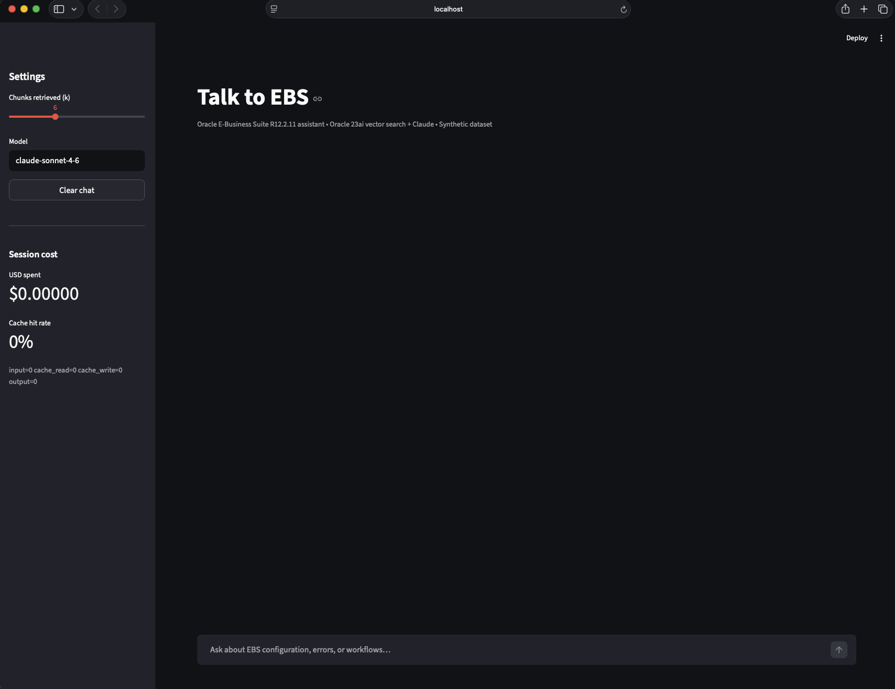

# Talk to EBS

Conversational AI for **Oracle E-Business Suite R12.2.11**, powered by
**Oracle Database 23ai** vector search and **Claude**.

Ask plain-English questions about EBS configuration, error scenarios,
and resolution procedures. Get grounded answers with inline citations
back to the source notes.



> Built by an Oracle Apps DBA learning AI infrastructure.
> Designed around production constraints (auth, audit, cost) rather than toy demos.
> Dataset is fully synthetic — no real customer or employer data.

---

## What it does

- **Semantic retrieval** over a corpus of EBS resolution notes using
  Oracle 23ai's native `VECTOR` datatype + `VECTOR_DISTANCE`
- **Grounded LLM answers** via Claude Sonnet with prompt caching
  (~80–90% cost reduction on follow-up turns)
- **Inline citations** — every answer cites `[NOTE-XXX §section]`
  so the user can trace claims back to a source chunk
- **Section-aware chunking** — splits notes on Markdown H2 headings
  (`Symptom / Diagnosis / Root cause / Resolution / …`),
  noticeably better retrieval recall than sliding-window
- **Streaming UI** in Streamlit with per-message Sources panel + a
  live cost / cache-hit-rate dashboard in the sidebar

## Architecture

```
┌──────────────────────────────────────────────────────────────────┐
│  Streamlit UI (app.py)                                           │
│   - Chat with streaming responses                                │
│   - Sidebar: cumulative USD cost + cache hit rate                │
└──────────────────────────────┬───────────────────────────────────┘
                               │
                               ▼
┌──────────────────────────────────────────────────────────────────┐
│  RAG orchestrator (src/oracle_ebs_rag/rag.py)                    │
│   1. retrieve top-k chunks                                       │
│   2. build prompt: system + context (cache_control=ephemeral)    │
│   3. stream answer from Claude with citations                    │
└────────────┬──────────────────────────────────────┬──────────────┘
             │                                      │
             ▼                                      ▼
┌──────────────────────────┐         ┌────────────────────────────┐
│ Oracle Database 23ai     │         │  Claude API                │
│  rag_documents           │         │  - Sonnet 4.6              │
│  rag_chunks              │         │  - prompt caching          │
│   • VECTOR(1024, FLOAT32)│         │    on system + context     │
│   • cosine VECTOR_DISTANCE│        │                            │
└──────────────────────────┘         └────────────────────────────┘
             ▲
             │
┌────────────┴─────────────┐
│  Ingestion pipeline      │
│  src/oracle_ebs_rag/     │
│   - chunker.py (sections)│
│   - embedder.py (Cohere) │
│   - ingest.py (CLI)      │
└──────────────────────────┘
             ▲
             │
   data/synthetic_notes/*.md
```

## Quickstart

### Prerequisites

- macOS 13+ with Apple Silicon (or amd64 Linux)
- Docker Desktop or [OrbStack](https://orbstack.dev/) (recommended on Apple Silicon)
- Python 3.12+
- [`uv`](https://github.com/astral-sh/uv) (`brew install uv`)
- API keys:
  - [Cohere](https://dashboard.cohere.com/) (free tier is plenty)
  - [Anthropic](https://console.anthropic.com/)

### 1. Start Oracle 23ai Free

```bash
docker pull gvenzl/oracle-free:23-slim-faststart
docker run -d --name oracle23ai -p 1521:1521 \
    -e ORACLE_PASSWORD=oracle \
    gvenzl/oracle-free:23-slim-faststart
docker logs -f oracle23ai   # wait for "DATABASE IS READY TO USE"
```

### 2. Create users + schema

```bash
docker exec -i oracle23ai sqlplus -S system/oracle@localhost:1521/FREEPDB1 < sql/01_users.sql
docker exec -i oracle23ai sqlplus -S ragapp/ragapp_dev_pwd@localhost:1521/FREEPDB1 < sql/02_schema.sql
docker exec -i oracle23ai sqlplus -S ragapp/ragapp_dev_pwd@localhost:1521/FREEPDB1 < sql/03_grants.sql
```

### 3. Install Python deps

```bash
uv sync
```

### 4. Configure API keys

```bash
cp .env.example .env
# Edit .env and set COHERE_API_KEY, ANTHROPIC_API_KEY.
# If on OrbStack, the default ORA_DSN already uses oracle23ai.orb.local
# which avoids macOS port-forwarding NAT issues (see "What I learned").
```

### 5. Ingest the synthetic dataset

```bash
uv run ingest
```

Expected: 3 documents, ~17 chunks ingested in under 5 seconds.

### 6. Try a query from the CLI

```bash
uv run python scripts/ask.py "Concurrent request stuck in Pending Normal — what do I check first?"
```

### 7. Launch the chat UI

```bash
uv run streamlit run app.py
```

Open <http://localhost:8501>.

## Project layout

```
oracle-ebs-rag/
├── app.py                          # Streamlit chat UI
├── pyproject.toml                  # uv-managed deps
├── sql/                            # 23ai schema + grants
│   ├── 01_users.sql
│   ├── 02_schema.sql
│   └── 03_grants.sql
├── src/oracle_ebs_rag/
│   ├── config.py                   # typed env settings (pydantic)
│   ├── db.py                       # oracledb connection helper
│   ├── chunker.py                  # markdown-section chunker
│   ├── embedder.py                 # Cohere wrapper (batched + retried)
│   ├── retrieve.py                 # top-k VECTOR_DISTANCE search
│   ├── rag.py                      # Claude orchestrator w/ prompt caching
│   └── ingest.py                   # CLI: data/*.md -> 23ai
├── scripts/
│   ├── hello_vector.py             # smoke test (one-hot vectors)
│   ├── search.py                   # ad-hoc semantic search CLI
│   └── ask.py                      # ad-hoc RAG answer CLI
├── data/synthetic_notes/           # the dataset (markdown + YAML frontmatter)
└── docs/                           # demo screenshot, design notes
```

## What I learned building this

A handful of moments that became "if I were writing the blog post" notes:

**OrbStack's port-forwarding NAT silently mangles Oracle TNS handshake
packets on macOS.** Symptom: `python-oracledb` thin-mode connections
return `Connection reset by peer` mid-handshake, with
`TNS-12537 / TNS-12560 / <unknown connect data>` showing up in
`/opt/oracle/diag/tnslsnr/*/listener/alert/log.xml`. The listener
*trace* log shows nothing because the packet never makes it to the
accept path. Fix: connect via `<container-name>.orb.local` instead
of `127.0.0.1`. OrbStack routes that natively without NAT, and the
handshake completes cleanly. Cost me an hour. Documented in `app.py`
so the next person doesn't pay it.

**Section-aware chunking beats sliding-window for structured notes.**
Each resolution note is `Symptom / Diagnosis / Root cause / Resolution`.
Splitting on H2 headings keeps the "Symptom" chunk semantically pure,
so a query like "queue is stuck" lands on Symptom chunks first.
Sliding-window mixes sections, polluting embeddings.

**Prompt caching pays off only on multi-turn follow-ups.** Each new
question retrieves a different context, so the first turn always
writes the cache. Follow-ups on the same topic read the cache and
costs drop ~85%. The Streamlit sidebar tracks the live hit rate.

**`SELECT_CATALOG_ROLE` replaces three explicit V$ grants.** First
draft of `sql/01_users.sql` had `GRANT SELECT ON v_$sql TO mcp_ro`
etc. — but those are SYS-owned and SYSTEM can't forward them.
`SELECT_CATALOG_ROLE` covers them all in one line. `CREATE INDEX`
is also not a system privilege when you own the table — common
Postgres/MySQL muscle-memory mistake.

**Oracle 23ai HNSW needs `vector_memory_size > 0`** which requires a
DB restart. For ~17 chunks, brute-force `VECTOR_DISTANCE` is well
under 50 ms, so the HNSW index is deferred to a future
"optimization" chapter with before/after benchmarks.

## Security & licensing notes

- `mcp_ro` user is intentionally low-privilege: `CREATE SESSION` +
  `SELECT_CATALOG_ROLE` + explicit `SELECT` on RAG tables. No
  `SELECT ANY TABLE`, no DML, no DDL.
- All `.env` values are dev-only. Never use these passwords in a
  shared or production environment.
- The dataset (`data/synthetic_notes/`) is entirely fictional. Any
  resemblance to real EBS environments is by design (the goal is
  realistic structure) but no real customer or internal data has
  been used.

## Evals

The pipeline has an automated eval harness that runs on every change.

| Metric                | Baseline | Notes |
|-----------------------|----------|-------|
| Retrieval recall @ 6  | **100%** | Across 10 golden questions (3 notes + 1 out-of-scope) |
| Must-contain pass     | **100%** | Required facts present in every answer |
| Must-not-contain pass | **100%** | Zero forbidden / destructive claims |
| Judge (Claude Haiku)  | **4.80 / 5** | Independent model from the answerer (Sonnet) |

Run locally:
```bash
uv run python tests/eval/harness.py        # score all questions
uv run python tests/eval/regression.py     # CI gate vs baseline
```

CI runs the eval on every PR via `.github/workflows/eval.yml`,
fails the build on >5pp drop in retrieval/fact-check (zero tolerance
on `must_not_contain`). See `tests/eval/golden.yaml` for the test cases.

## Roadmap

- [x] Eval harness: golden set + Claude-Haiku-as-judge + CI regression gate
- [ ] Grow golden set from 10 → 50 questions across 6+ categories
- [ ] HNSW vector index + before/after retrieval-latency benchmark
- [ ] AWR-aware MCP server (separate repo): summarize top SQL, wait
      events, time model for LLM consumption
- [ ] Hybrid retrieval (vector + BM25 keyword) using Oracle Text
- [ ] PDF ingestion pipeline for the public EBS R12.2 admin guides

## License

MIT. Oracle, E-Business Suite, and Database 23ai are trademarks of
Oracle Corporation. This project is not affiliated with or endorsed
by Oracle.
